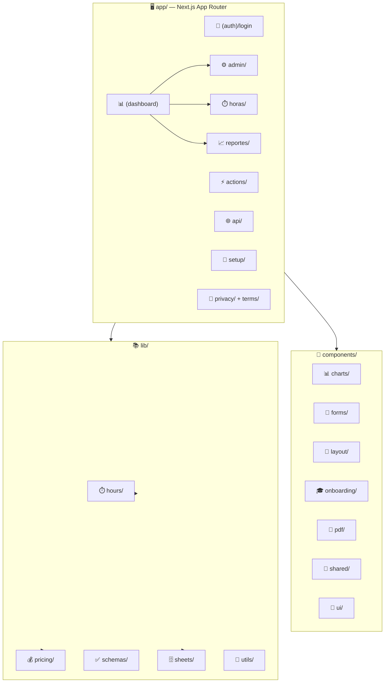

# ⏱️ Ptime — Professional Time Tracking & Invoicing

> **Your spreadsheet is your backend.** Ptime turns a Google Sheet into a full
> time-tracking, billing, and reporting platform — deployed in minutes on the
> Vercel + Google Workspace ecosystem.

[](https://nextjs.org)
[](https://react.dev)
[](https://www.typescriptlang.org)
[](https://tailwindcss.com)
[](https://vitest.dev)

---

## ✨ Why Ptime?

Most time-tracking tools lock your data in a proprietary database. **Ptime does
the opposite** — it uses a Google Sheet you already own as its database:

- 🗂️ **You keep full control** — edit data directly in Sheets anytime
- 🔓 **No vendor lock-in** — your hours, clients, and invoices are just rows
- 🚀 **Instant setup** — connect a spreadsheet, invite collaborators, start tracking
- 🌐 **Cross-device** — your workspace follows you without reconfiguration

---

## 🎯 Features

| Feature | Description |
|---|---|
| 🗄️ **Google Sheets as Database** | Your spreadsheet IS the backend. Edit in Sheets or through the app. |
| 🔐 **Secure Authentication** | NextAuth.js v5 + Google OAuth 2.0, JWT sessions, RBAC roles. |
| 💰 **Tiered Billing Engine** | 20h/month threshold per user — base rate up to 20h, premium after. Smart 0.5h/1h rounding. |
| 📊 **BI & Reports** | Interactive charts: income trends, client breakdown, task distribution, activity heatmap, PDF export. |
| 👥 **Shared Workspaces** | Invite collaborators with OWNER / COLLABORATOR / VIEWER roles. |
| 🔄 **Cross-Device Persistence** | Sheet ID persists via JWT — no re-setup between devices. |
| 🌙 **Dark / Light Mode** | Semantic CSS tokens, glass effects, Framer Motion animations. |
| 💱 **USD + ARS Support** | Track USD pricing with ARS conversion via the official BNA rate. |
| 🧪 **Test Suite** | 45+ Vitest tests covering pricing, hours, serialization, BNA, and helpers. |
| 🛠️ **Pricing Audit Tool** | One command to verify any month matches the official billing logic. |

---

## 🧱 Tech Stack

| Category | Technology |
|----------|-----------|
| ⚛️ Framework | [Next.js 14](https://nextjs.org/) (App Router) |
| 🎨 UI | [React 18](https://react.dev/) + [Tailwind CSS v3](https://tailwindcss.com/) |
| 🧩 Components | [Shadcn/UI](https://ui.shadcn.com/) (Radix Primitives) |
| 🔐 Auth | [NextAuth.js v5](https://nextjs.authjs.dev/) |
| 📈 Charts | [Apache ECharts](https://echarts.apache.org/) |
| ✨ Animation | [Framer Motion](https://www.framer.com/motion/) |
| ✅ Validation | [Zod](https://zod.dev/) |
| 📝 Forms | [React Hook Form](https://react-hook-form.com/) |
| ☁️ Google APIs | Sheets REST v4 + service account (edge) |
| 🧪 Testing | [Vitest](https://vitest.dev/) |
| 🚀 Hosting | [Vercel](https://vercel.com/) |

---

## 🚀 Quick Start

### Prerequisites

- ✅ **Node.js ≥ 20**
- ✅ A **Google Cloud Console** project with the **Sheets API** enabled
- ✅ **OAuth 2.0 credentials** (Web application type) from GCP

### Setup

```bash
# 1. Install dependencies
npm install

# 2. Configure environment
cp .env.example .env
# Fill in: GOOGLE_CLIENT_ID, GOOGLE_CLIENT_SECRET, AUTH_SECRET, MASTER_SHEET_ID

# 3. Run it
npm run dev
```

### 🧪 Local Dev Without OAuth

```bash
LOCAL_DEV_ACCESS=true npm run dev
```

> Only works on `localhost` with `NODE_ENV !== "production"`. Perfect for
> quick iteration without Google setup.

### ✅ Verify Everything Works

```bash
npm run test:run     # 🧪 Run Vitest suite
npx tsc --noEmit     # 📐 TypeScript check
npm run lint         # 🔍 ESLint
npm run build        # 🏗️ Production build
```

---

## 💰 Billing Rules — How Pricing Works

Ptime uses a **tiered monthly pricing model**, global per user:

| Rule | Detail |
|---|---|
| 🎯 **Threshold** | **20h per month per user** (global — NOT per project) |
| ✅ **Up to 20h** | **Base rate** ($35 default) — fractions round to **0.5h** (ceil) |
| 🚀 **After 20h** | **Premium rate** ($45 default) — fractions round to **next full hour** (ceil) |
| 🔀 **Crossing the threshold** | Base portion rounds to 0.5h; premium portion rounds to full hour |

### 📐 Example

> Accumulated **19h** + new record of **2.5h**:
>
> - **19h → 20h** = 1h at base (0.5h rounding) → 1h × $35 = **$35**
> - **20h → 21.5h** = 1.5h at premium (1h rounding) → 2h × $45 = **$90**
> - **Total = $125**

### 🧠 Chronological Accumulation

The accumulated hours for a record = sum of the **same month's records with a
date strictly before** its own date. This guarantees that **editing an old
record never re-prices it** with hours entered later — see
`getAccumulatedWorkedHoursUpTo` in `lib/hours/accounting.ts`.

---

## 🛠️ Pricing Audit Tool

One command to verify that hours, billable hours, and amounts in the sheet
match the official pricing logic — for **any month**:

```bash
# 📊 Report for the current month
npm run audit:pricing

# 📅 Specific month
npm run audit:pricing -- --month 2026-08

# 👀 Dry-run: show what would be corrected (no writes)
npm run audit:pricing -- --month 2026-08 --dry-run

# ✏️ Apply corrections (requires explicit user approval!)
npm run audit:pricing -- --month 2026-08 --fix
```

**How it works:**
- 📖 Reads `Registros_Horas` + `Proyectos` directly from the sheet via `gws`
- 🧮 Recomputes every record with the official logic (chronological accumulation)
- 📋 Reports totals + per-record discrepancies (row, id, sheet vs expected, breakdown)
- 🔒 **Never writes without `--fix`** — and `--fix` always requires user approval

**Requirements:** `gws` authenticated with the workspace account and
`GOOGLE_WORKSPACE_PROJECT_ID` set in the environment (values come from your
local environment, never from the repo).

> 📚 Full procedure: `docs/skills/ptime-pricing-audit.md`

---

## ☁️ Deployment (Vercel)

1. **Import** the repo in Vercel
2. **Set environment variables**:
   - `AUTH_SECRET`, `AUTH_URL`
   - `GOOGLE_CLIENT_ID`, `GOOGLE_CLIENT_SECRET`
   - `MASTER_SHEET_ID`, `GOOGLE_SERVICE_ACCOUNT_EMAIL`, `GOOGLE_PRIVATE_KEY`
   - `ADMIN_EMAILS` (comma-separated)
3. **Update the authorized redirect URI** in GCP:
   `https://your-domain/api/auth/callback/google`

---

## 🗂️ Project Structure



```
.
├── app/                          # 🖥️ Next.js App Router
│   ├── (auth)/login/             # 🔐 Authentication pages
│   ├── (dashboard)/              # 📊 Protected routes
│   │   ├── admin/                # ⚙️ CRUD: clients, projects, tasks, users, config, workspace
│   │   ├── dashboard/            # 🏠 Main dashboard + KPIs
│   │   ├── horas/                # ⏱️ Time entries (list, detail, create, edit)
│   │   └── reportes/             # 📈 BI reports + charts + PDF export
│   ├── actions/                  # ⚡ Server Actions (CRUD mutations)
│   ├── api/                      # 🌐 API routes (auth, health, BNA dollar, horas)
│   ├── privacy/ & terms/         # 📄 Legal pages (Google OAuth requirement)
│   └── setup/                    # 🔧 Initial spreadsheet configuration
├── components/
│   ├── charts/                   # 📊 ECharts components (heatmap, line, pie, sparkline)
│   ├── forms/                    # 📝 Hour entry form
│   ├── layout/                   # 🧭 Sidebar, Topbar, DashboardShell
│   ├── onboarding/               # 🎓 Interactive onboarding tour
│   ├── pdf/                      # 📄 PDF report templates
│   ├── providers/                # 🔗 LocaleProvider (i18n)
│   ├── shared/                   # 🔧 DataTable, ExportButton, FilterBar
│   ├── landing-page.tsx          # 🌍 Public landing page
│   └── ui/                       # 🎨 Shadcn primitives
├── lib/
│   ├── hours/                    # ⏱️ Save flow, accounting, monthly, currency
│   ├── pricing/                  # 💰 Tiered pricing algorithm
│   ├── schemas/                  # ✅ Zod validation schemas
│   ├── sheets/                   # 🗄️ Sheets client, queries, mutations, serializers
│   └── utils/                    # 🔧 Formatters, sanitizers, helpers
├── types/                        # 📦 TypeScript interfaces
├── public/                       # 🖼️ Static assets (logos, icons, background)
├── docs/                         # 📚 Planning & verification docs
├── scripts/                      # 🛠️ Migration + audit scripts
├── auth.ts                       # 🔐 NextAuth configuration
├── middleware.ts                 # 🛡️ Route protection + sheet context
└── CHANGELOG.md                  # 📜 Full version history
```

---

## 📚 Documentation

| Doc | Description |
|---|---|
| [📜 CHANGELOG.md](./CHANGELOG.md) | Full version history |
| [🛡️ docs/GUARDRAILS.md](./docs/GUARDRAILS.md) | Developer pre-commit checklist |
| [🛠️ docs/skills/ptime-pricing-audit.md](./docs/skills/ptime-pricing-audit.md) | Pricing audit procedure |
| [✅ docs/gcp-verification-response.md](./docs/gcp-verification-response.md) | Google OAuth verification |

---

## 📄 License

**Proprietary** — © [TuCloud.pro](https://tucloud.pro). All rights reserved.
